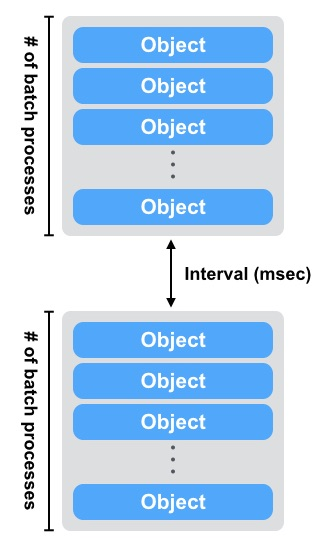

.. =========================================================
.. LeoFS documentation
.. Copyright (c) 2012-2014 Rakuten, Inc.
.. http://leo-project.net/
.. =========================================================

.. index::
   pair: Configuration; LeoFS Storage

.. _conf_storage_label:

LeoFS Storage
=============

LeoFS Storage configuration
---------------------------

* Location of configuration file:
    * *<leofs-home-dir>/package/storage/etc/leo_storage.conf* OR */usr/local/leofs/<version>/leo_storage/etc/leo_storage.conf*

+-----------------------------------------------------+--------------------------------------------+--------------------------------------------------------------------------------------------------------------------+
|Property                                             | Default Value                              | Description                                                                                                        |
+=====================================================+============================================+====================================================================================================================+
| **LeoFS Manager**                                                                                                                                                                                                     |
+-----------------------------------------------------+--------------------------------------------+--------------------------------------------------------------------------------------------------------------------+
|managers                                             | [manager_0@127.0.0.1, manager_1@127.0.0.1] | Node name of LeoFS Manager master and slave nodes                                                                  |
+-----------------------------------------------------+--------------------------------------------+--------------------------------------------------------------------------------------------------------------------+
| **LeoFS Storage Basic Configuration**                                                                                                                                                                                 |
+-----------------------------------------------------+--------------------------------------------+--------------------------------------------------------------------------------------------------------------------+
|obj_containers.path                                  | [./avs]                                    | Directories of object-container                                                                                    |
+-----------------------------------------------------+--------------------------------------------+--------------------------------------------------------------------------------------------------------------------+
|obj_containers.num_of_containers                     | [8]                                        | A number of object-containers                                                                                      |
+-----------------------------------------------------+--------------------------------------------+--------------------------------------------------------------------------------------------------------------------+
|obj_containers.metadata_storage                      | leveldb                                    | Metadata Storage - [bitcask, leveldb]                                                                              |
+-----------------------------------------------------+--------------------------------------------+--------------------------------------------------------------------------------------------------------------------+
|num_of_vnodes                                        | 168                                        | A number of virtual-nodes for the redundant-manager                                                                |
+-----------------------------------------------------+--------------------------------------------+--------------------------------------------------------------------------------------------------------------------+
|object_storage.is_strict_check                       | false                                      | Enable strict check between checksum of a metadata and checksum of an object                                       |
+-----------------------------------------------------+--------------------------------------------+--------------------------------------------------------------------------------------------------------------------+
| **Watchdog**                                                                                                                                                                                                          |
+-----------------------------------------------------+--------------------------------------------+--------------------------------------------------------------------------------------------------------------------+
| *rex(rpc)*                                                                                                                                                                                                            |
+-----------------------------------------------------+--------------------------------------------+--------------------------------------------------------------------------------------------------------------------+
|watchdog.rex.interval                                | 5                                          | Watch interval for the rex*(rpc)* process in order to execute force GC when reaching the threshold value           |
+-----------------------------------------------------+--------------------------------------------+--------------------------------------------------------------------------------------------------------------------+
|watchdog.rex.threshold_mem_capacity                  | 33554432                                   | Threshold memory capacity of binary for rex*(rpc)*                                                                 |
+-----------------------------------------------------+--------------------------------------------+--------------------------------------------------------------------------------------------------------------------+
| *CPU*                                                                                                                                                                                                                 |
+-----------------------------------------------------+--------------------------------------------+--------------------------------------------------------------------------------------------------------------------+
| watchdog.cpu.is_enabled                             | false                                      | Enabled or disabled CPU-watchdog  *[true|false]*                                                                   |
+-----------------------------------------------------+--------------------------------------------+--------------------------------------------------------------------------------------------------------------------+
| watchdog.cpu.interval                               | 5                                          | Watch interval(sec) for CPU-watchdog                                                                               |
+-----------------------------------------------------+--------------------------------------------+--------------------------------------------------------------------------------------------------------------------+
| watchdog.cpu.raised_error_times                     | 3                                          | An error is raised to subscribers when a number of errors reached this configuration.                              |
+-----------------------------------------------------+--------------------------------------------+--------------------------------------------------------------------------------------------------------------------+
| watchdog.cpu.threshold_cpu_load_avg                 | 5.0                                        | Threshold CPU load avg for 1min/5min                                                                               |
+-----------------------------------------------------+--------------------------------------------+--------------------------------------------------------------------------------------------------------------------+
| watchdog.cpu.threshold_cpu_util                     | 100                                        | Threshold CPU load util *(%)*                                                                                      |
+-----------------------------------------------------+--------------------------------------------+--------------------------------------------------------------------------------------------------------------------+
| *IO*                                                                                                                                                                                                                  |
+-----------------------------------------------------+--------------------------------------------+--------------------------------------------------------------------------------------------------------------------+
| watchdog.io.is_enabled                              | false                                      | Enabled or disabled io-watchdog *[true|false]*                                                                     |
+-----------------------------------------------------+--------------------------------------------+--------------------------------------------------------------------------------------------------------------------+
| watchdog.io.interval                                | 1                                          | Watch interval *(sec)* for Eralng-IO watchdog                                                                      |
+-----------------------------------------------------+--------------------------------------------+--------------------------------------------------------------------------------------------------------------------+
| watchdog.io.threshold_input_per_sec                 | 134217728                                  | Threshold input size/sec *(byte)*                                                                                  |
+-----------------------------------------------------+--------------------------------------------+--------------------------------------------------------------------------------------------------------------------+
| watchdog.io.threshold_output_per_sec                | 134217728                                  | Threshold output size/se *(byte)*                                                                                  |
+-----------------------------------------------------+--------------------------------------------+--------------------------------------------------------------------------------------------------------------------+
| *DISK*                                                                                                                                                                                                                |
+-----------------------------------------------------+--------------------------------------------+--------------------------------------------------------------------------------------------------------------------+
| watchdog.disk.is_enabled                            | false                                      | Enabled or disabled disk-watchdog *[true|false]*                                                                   |
+-----------------------------------------------------+--------------------------------------------+--------------------------------------------------------------------------------------------------------------------+
| watchdog.disk.interval                              | 1                                          | Watch interval *(sec)* for Disk-watchdog                                                                           |
+-----------------------------------------------------+--------------------------------------------+--------------------------------------------------------------------------------------------------------------------+
| watchdog.disk.raised_error_times                    | 3                                          | An error is subscribers to clients when a number of errors reached this configuration.                             |
+-----------------------------------------------------+--------------------------------------------+--------------------------------------------------------------------------------------------------------------------+
| watchdog.disk.threshold_disk_use                    | 85                                         | Threshold disk use *(%)*                                                                                           |
+-----------------------------------------------------+--------------------------------------------+--------------------------------------------------------------------------------------------------------------------+
| watchdog.disk.threshold_disk_util                   | 100                                        | Threshold disk util *(%)*                                                                                          |
+-----------------------------------------------------+--------------------------------------------+--------------------------------------------------------------------------------------------------------------------+
| watchdog.disk.threshold_disk_rkb                    | 262144                                     | Threshold disk read KB/sec                                                                                         |
+-----------------------------------------------------+--------------------------------------------+--------------------------------------------------------------------------------------------------------------------+
| watchdog.disk.threshold_disk_wkb                    | 262144                                     | Threshold disk write KB/sec                                                                                        |
+-----------------------------------------------------+--------------------------------------------+--------------------------------------------------------------------------------------------------------------------+
| watchdog.disk.target_devices                        | []                                         | Target devices for checking disk utilization                                                                       |
+-----------------------------------------------------+--------------------------------------------+--------------------------------------------------------------------------------------------------------------------+
| **Autonomic Operation**                                                                                                                                                                                               |
+-----------------------------------------------------+--------------------------------------------+--------------------------------------------------------------------------------------------------------------------+
| autonomic_op.compaction.is_enabled                  | false                                      | * Is enabled auto-compaction?  *[true|false]*                                                                      |
+-----------------------------------------------------+--------------------------------------------+--------------------------------------------------------------------------------------------------------------------+
| autonomic_op.compaction.parallel_procs              | 1                                          | * Number of parallel procs of data-compaction                                                                      |
+-----------------------------------------------------+--------------------------------------------+--------------------------------------------------------------------------------------------------------------------+
| autonomic_op.compaction.threshold_active_size_ratio | 70                                         | * Warning ratio of active size *(%)*                                                                               |
|                                                     |                                            | * NOT affects the auto-compaction by this configuration yet. We plan to support this configuration with v1.4.      |
+-----------------------------------------------------+--------------------------------------------+--------------------------------------------------------------------------------------------------------------------+
| autonomic_op.compaction.threshold_active_size_ratio | 60                                         | * Threshold ratio of active size *(%)*                                                                             |
|                                                     |                                            | * (Size of active objects / Size of total objects) * 100 *(%)*                                                     |
|                                                     |                                            | * When it was less than the ratio, LeoFS Storage executes data-compaction automatically                            |
+-----------------------------------------------------+--------------------------------------------+--------------------------------------------------------------------------------------------------------------------+
| **Data Compaction**                                                                                                                                                                                                   |
+-----------------------------------------------------+--------------------------------------------+--------------------------------------------------------------------------------------------------------------------+
| compaction.limit_num_of_compaction_procs            | 4                                          | Limit of a number of procs to execute data-compaction in parallel                                                  |
+-----------------------------------------------------+--------------------------------------------+--------------------------------------------------------------------------------------------------------------------+
| *Data Compaction - Interval between batch processings*                                                                                                                                                                |
+-----------------------------------------------------+--------------------------------------------+--------------------------------------------------------------------------------------------------------------------+
| compaction.waiting_time_min                         | 100                                        | Minimum value of compaction-proc waiting time/batch-proc(msec)                                                     |
+-----------------------------------------------------+--------------------------------------------+--------------------------------------------------------------------------------------------------------------------+
| compaction.waiting_time_regular                     | 300                                        | Regular value of compaction-proc waiting time/batch-proc(msec)                                                     |
+-----------------------------------------------------+--------------------------------------------+--------------------------------------------------------------------------------------------------------------------+
| compaction.waiting_time_max                         | 1000                                       | Maximum value of compaction-proc waiting time/batch-proc(msec)                                                     |
+-----------------------------------------------------+--------------------------------------------+--------------------------------------------------------------------------------------------------------------------+
| compaction.waiting_time_step                        | 100                                        | Step of compaction-proc waiting time(msec)                                                                         |
+-----------------------------------------------------+--------------------------------------------+--------------------------------------------------------------------------------------------------------------------+
| *Data Compaction - Number of objects a batch processing*                                                                                                                                                              |
+-----------------------------------------------------+--------------------------------------------+--------------------------------------------------------------------------------------------------------------------+
| compaction.batch_procs_min                          | 1000                                       | Minimum number of objects a batch processing                                                                       |
+-----------------------------------------------------+--------------------------------------------+--------------------------------------------------------------------------------------------------------------------+
| compaction.batch_procs_regular                      | 10000                                      | Regular number of objects a batch processing                                                                       |
+-----------------------------------------------------+--------------------------------------------+--------------------------------------------------------------------------------------------------------------------+
| compaction.batch_procs_max                          | 100000                                     | Maximum number of objects a batch processing                                                                       |
+-----------------------------------------------------+--------------------------------------------+--------------------------------------------------------------------------------------------------------------------+
| compaction.batch_procs_step                         | 10000                                      | Step number of objects a batch processing                                                                          |
+-----------------------------------------------------+--------------------------------------------+--------------------------------------------------------------------------------------------------------------------+
| **MQ**                                                                                                                                                                                                                |
+-----------------------------------------------------+--------------------------------------------+--------------------------------------------------------------------------------------------------------------------+
| mq.backend_db = bitcask                             | bitcask                                    | MQ backend storage: [bitcask]                                                                                      |
+-----------------------------------------------------+--------------------------------------------+--------------------------------------------------------------------------------------------------------------------+
| mq.num_of_mq_procs                                  | 8                                          | A number of mq-server's processes                                                                                  |
+-----------------------------------------------------+--------------------------------------------+--------------------------------------------------------------------------------------------------------------------+
| *MQ - Number of messages a batch processing*                                                                                                                                                                          |
+-----------------------------------------------------+--------------------------------------------+--------------------------------------------------------------------------------------------------------------------+
| mq.num_of_batch_process_min                         | 100                                        | Minimum number of messages a bach processing                                                                       |
+-----------------------------------------------------+--------------------------------------------+--------------------------------------------------------------------------------------------------------------------+
| mq.num_of_batch_process_max                         | 10000                                      | Maximum number of messages a bach processing                                                                       |
+-----------------------------------------------------+--------------------------------------------+--------------------------------------------------------------------------------------------------------------------+
| mq.num_of_batch_process_regular                     | 1000                                       | Regular number of messages a bach processing                                                                       |
+-----------------------------------------------------+--------------------------------------------+--------------------------------------------------------------------------------------------------------------------+
| mq.num_of_batch_process_step                        | 250                                        | Step number of message a batch processing. Increase/Decrease a number of batch process by this value.              |
+-----------------------------------------------------+--------------------------------------------+--------------------------------------------------------------------------------------------------------------------+
| *MQ - Interval between batch processings*                                                                                                                                                                             |
+-----------------------------------------------------+--------------------------------------------+--------------------------------------------------------------------------------------------------------------------+
| mq.interval_between_batch_procs_min                 | 10                                         | Minimum value of interval beween batch-procs(msec)                                                                 |
+-----------------------------------------------------+--------------------------------------------+--------------------------------------------------------------------------------------------------------------------+
| mq.interval_between_batch_procs_max                 | 1000                                       | Maximum value of interval beween batch-procs(msec)                                                                 |
+-----------------------------------------------------+--------------------------------------------+--------------------------------------------------------------------------------------------------------------------+
| mq.interval_between_batch_procs_regular             | 300                                        | Regular value of interval between batch-procs(msec)                                                                |
+-----------------------------------------------------+--------------------------------------------+--------------------------------------------------------------------------------------------------------------------+
| mq.interval_between_batch_procs_step                | 100                                        | Step value of interval between batch-procs(msec). Increase/Decrease an interval between batch-procs by this value. |
+-----------------------------------------------------+--------------------------------------------+--------------------------------------------------------------------------------------------------------------------+
| **STORAGE - Replication/Recovery object(s)**                                                                                                                                                                          |
+-----------------------------------------------------+--------------------------------------------+--------------------------------------------------------------------------------------------------------------------+
| replication.rack_awareness.rack_id                  | []                                         | Rack-id for the rack-awareness replica placement                                                                   |
+-----------------------------------------------------+--------------------------------------------+--------------------------------------------------------------------------------------------------------------------+
| replication.recovery.size_of_stacked_objs           | 33554432                                   | Size of stacked objects (bytes)                                                                                    |
+-----------------------------------------------------+--------------------------------------------+--------------------------------------------------------------------------------------------------------------------+
| replication.recovery.stacking_timeout               | 5                                          | Stacking timeout (sec)                                                                                             |
+-----------------------------------------------------+--------------------------------------------+--------------------------------------------------------------------------------------------------------------------+
| **STORAGE - MDC Replication**                                                                                                                                                                                         |
+-----------------------------------------------------+--------------------------------------------+--------------------------------------------------------------------------------------------------------------------+
| mdc_replication.size_of_stacked_objs                | 33554432                                   | Size of stacked objects (bytes)                                                                                    |
+-----------------------------------------------------+--------------------------------------------+--------------------------------------------------------------------------------------------------------------------+
| mdc_replication.stacking_timeout                    | 30                                         | Stacking timeout (sec)                                                                                             |
+-----------------------------------------------------+--------------------------------------------+--------------------------------------------------------------------------------------------------------------------+
| mdc_replication.req_timeout                         | 30000                                      | Request timeout (msec)                                                                                             |
+-----------------------------------------------------+--------------------------------------------+--------------------------------------------------------------------------------------------------------------------+
| mdc_replication.stacking_procs                      | 1                                          | Number of stacking procecces                                                                                       |
+-----------------------------------------------------+--------------------------------------------+--------------------------------------------------------------------------------------------------------------------+
| **RPC for MDC-replication**                                                                                                                                                                                           |
+-----------------------------------------------------+--------------------------------------------+--------------------------------------------------------------------------------------------------------------------+
| rpc.server.acceptors                                | 128                                        | Number of RPC-server's acceptors                                                                                   |
+-----------------------------------------------------+--------------------------------------------+--------------------------------------------------------------------------------------------------------------------+
| rpc.server.listen_port                              | 13077                                      | RPC-Server's listening port number                                                                                 |
+-----------------------------------------------------+--------------------------------------------+--------------------------------------------------------------------------------------------------------------------+
| rpc.server.listen_timeout                           | 30000                                      | RPC-Server's listening timeout (msec)                                                                              |
+-----------------------------------------------------+--------------------------------------------+--------------------------------------------------------------------------------------------------------------------+
| rpc.client.connection_pool_size                     | 8                                          | RPC-Client's size of connection pool                                                                               |
+-----------------------------------------------------+--------------------------------------------+--------------------------------------------------------------------------------------------------------------------+
| rpc.client.connection_buffer_size                   | 8                                          | RPC-Client's size of connection buffer                                                                             |
+-----------------------------------------------------+--------------------------------------------+--------------------------------------------------------------------------------------------------------------------+
| **Log**                                                                                                                                                                                                               |
+-----------------------------------------------------+--------------------------------------------+--------------------------------------------------------------------------------------------------------------------+
| log.log_level                                       | 1                                          | Log level: [0:debug, 1:info, 2:warn, 3:error]                                                                      |
+-----------------------------------------------------+--------------------------------------------+--------------------------------------------------------------------------------------------------------------------+
| log.erlang                                          | ./log/erlang                               | Locatio of Erlang log-files                                                                                        |
+-----------------------------------------------------+--------------------------------------------+--------------------------------------------------------------------------------------------------------------------+
| log.app                                             | ./log/app                                  | Locatio of Gateway's log-files                                                                                     |
+-----------------------------------------------------+--------------------------------------------+--------------------------------------------------------------------------------------------------------------------+
| log.member_dir                                      | ./log/ring                                 | Location of dump files of members of a storage cluster                                                             |
+-----------------------------------------------------+--------------------------------------------+--------------------------------------------------------------------------------------------------------------------+
| log.ring_dir                                        | ./log/ring                                 | Location of RING's dump files                                                                                      |
+-----------------------------------------------------+--------------------------------------------+--------------------------------------------------------------------------------------------------------------------+
| *Others**                                                                                                                                                                                                             |
+-----------------------------------------------------+--------------------------------------------+--------------------------------------------------------------------------------------------------------------------+
| queue_dir                                           | ./work/queue                               | Directory of queue for monitoring "RING" and members of a storage cluster                                          |
+-----------------------------------------------------+--------------------------------------------+--------------------------------------------------------------------------------------------------------------------+
| snmp_agent                                          | ./snmp/snmpa_gateway_0/LEO-GATEWAY         | Directory of SNMP agent configuration                                                                              |
+-----------------------------------------------------+--------------------------------------------+--------------------------------------------------------------------------------------------------------------------+

See Also
^^^^^^^^

* `LeoFS watchdog configuration <configuration_7.html>`_
* `LeoFS auto-compaction configuration <configuration_8.html>`_

Erlang VM configuration
-----------------------

+-----------------------------------------------------+--------------------------------------------+--------------------------------------------------------------------------------------------------------------------+
|Property                                             | Default Value                              | Description                                                                                                        |
+=====================================================+============================================+====================================================================================================================+
| nodename                                            | storage_0@127.0.0.1                        | Node name of LeoFS Storage                                                                                         |
+-----------------------------------------------------+--------------------------------------------+--------------------------------------------------------------------------------------------------------------------+
| distributed_cookie                                  | 401321b4                                   | Cookie for distributed node communication                                                                          |
+-----------------------------------------------------+--------------------------------------------+--------------------------------------------------------------------------------------------------------------------+
| erlang.kernel_poll                                  | true                                       | Enable or disable  kernel poll                                                                                     |
+-----------------------------------------------------+--------------------------------------------+--------------------------------------------------------------------------------------------------------------------+
| erlang.async_threads                                | 32                                         | Number of async threads                                                                                            |
+-----------------------------------------------------+--------------------------------------------+--------------------------------------------------------------------------------------------------------------------+
| erlang.max_ports                                    | 64000                                      | Number of concurrent ports/sockets                                                                                 |
+-----------------------------------------------------+--------------------------------------------+--------------------------------------------------------------------------------------------------------------------+
| erlang.crash_dump                                   | ./log/erl_crash.dump                       | Location of crash dumps                                                                                            |
+-----------------------------------------------------+--------------------------------------------+--------------------------------------------------------------------------------------------------------------------+
| erlang.max_ets_tables                               | 256000                                     | ETS table limit                                                                                                    |
+-----------------------------------------------------+--------------------------------------------+--------------------------------------------------------------------------------------------------------------------+
| erlang.smp                                          | enable                                     | Enable or disable SMP                                                                                              |
+-----------------------------------------------------+--------------------------------------------+--------------------------------------------------------------------------------------------------------------------+
| erlang.schedulers.compaction_of_load                | true                                       | Erlang scheduler's compaction of load                                                                              |
+-----------------------------------------------------+--------------------------------------------+--------------------------------------------------------------------------------------------------------------------+
| erlang.schedulers.utilization_balancing             | false                                      | Erlang scheduler's balancing of load                                                                               |
+-----------------------------------------------------+--------------------------------------------+--------------------------------------------------------------------------------------------------------------------+
| erlang.distribution_buffer_size                     | 32768                                      | Sender-side network distribution buffer size (KB)                                                                  |
+-----------------------------------------------------+--------------------------------------------+--------------------------------------------------------------------------------------------------------------------+
| erlang.fullsweep_after                              | 0                                          | A non-negative integer which indicates how many times generational garbage collections                             |
|                                                     |                                            | can be done without forcing a fullsweep collection                                                                 |
+-----------------------------------------------------+--------------------------------------------+--------------------------------------------------------------------------------------------------------------------+
| erlang.secio                                        | false                                      | Enable or disable eager check I/O (Erlang 17.4/erts-6.3-, ref:OTP-12117)                                           |
+-----------------------------------------------------+--------------------------------------------+--------------------------------------------------------------------------------------------------------------------+
| process_limit                                       | 1048576                                    | Default erlang process limit                                                                                       |
+-----------------------------------------------------+--------------------------------------------+--------------------------------------------------------------------------------------------------------------------+
| snmp_conf                                           | ./snmp/snmpa_storage_0/leo_storage_snmp    | SNMPA configuration files directory                                                                                |
+-----------------------------------------------------+--------------------------------------------+--------------------------------------------------------------------------------------------------------------------+

See Also
^^^^^^^^

* |erlang-erl|

.. index::
   pair: LeoFS Storage; Configuration related to MQ

Configuration related to MQ
---------------------------

LeoFS's MQ mechanism is affected by **the watchdog mechanism** in order to reduce costs of a message comsumption. MQ dinamically updates ``a num of batch processes`` and ``an interval`` *(Figure: Number-of-batch-processes and interval)*.

* *Figure: Number-of-batch-processes and interval*

.. image:: ../../_static/images/leofs-mq-figure.jpg
   :width: 240px

\

As of *Figure: Relationship of Watchdog and MQ*, the watchdog automatically adjusts value of **a num of batch processes** between ``mq.num_of_batch_process_min`` and ``mq.num_of_batch_process_max``, which is increased or decreased with ``mq.num_of_batch_process_step``.

On the other hands value of **an interval** is adjusted between ``mq.interval_between_batch_procs_min`` and ``mq.interval_between_batch_procs_max``, which is increased or decreased with ``mq.interval_between_batch_procs_step``.

When the each value reached the min value, the MQ changes the status to ``suspending``, after that the node's processing costs is changed to low, the MQ updates the status to ``running``, again.

* *Figure: Relationship between Watchdog and MQ*

.. image:: ../../_static/images/leofs-watchdog-mq.jpg
   :width: 640px

\

See Also
^^^^^^^^

* `LeoFS Storage Operation <../admin_guide/admin_guide_3.html>`_
* `LeoFS Watchdog configuration <../configuration/configuration_7.html>`_

\

.. index::
   pair: LeoFS Storage; Configuration related to the auto-compaction

Configuration related to the auto-compaction
--------------------------------------------

LeoFS's auto-compaction mechanism is affected by **the watchdog mechanism** in order to reduce costs of a the processing. The auto-compaction dinamically updates ``a num of batch processes`` and ``an interval`` *(Figure: Number-of-batch-processes and interval)*. The basic design of the relationship with the watchdog is similar to the MQ.

* *Figure: Number-of-batch-processes and interval*

\

As of *Figure: Relationship of Watchdog and Auto-compaction*, the watchdog automatically adjusts value of **a num of batch processes** between ``compaction.batch_procs_min`` and ``compaction.batch_procs_max``, which is increased or decreased with ``compaction.batch_procs_step``.

On the other hands value of **an interval** is adjusted between ``compaction.waiting_time_min`` and ``compaction.waiting_time_max``, which is increased or decreased with ``compaction.waiting_time_step``.

When the each value reached the min value, the auto-compaction changes the status to ``suspending``, after that the node's processing costs is changed to low, the auto-compaction updates the status to ``running``, again.

* *Figure: Relationship between Watchdog and Auto-compaction*

\

See Also
^^^^^^^^

* `LeoFS Storage Operation <../admin_guide/admin_guide_3.html>`_
* `LeoFS Auto-compaction configuration <../configuration/configuration_8.html>`_

\

.. |erlang-erl| raw:: html

   <a href="http://erlang.org/doc/man/erl.html" target="_blank">Eralng - erl</a>
